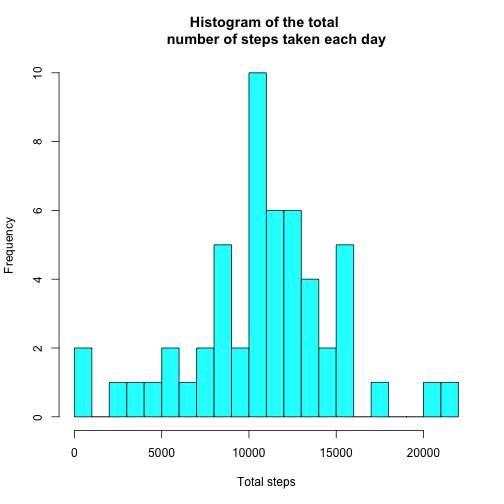
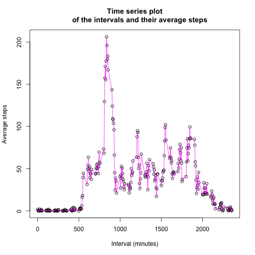
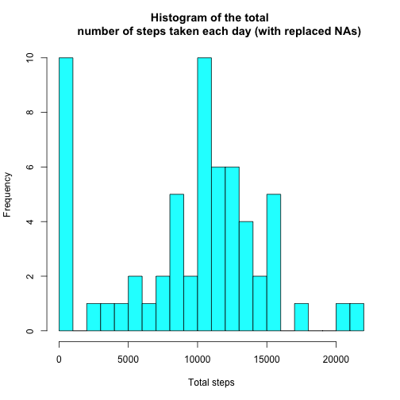
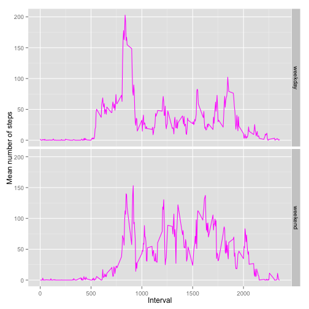

## Loading and preprocessing the data


```r
setwd("/Users/Javier/Desktop")
activity <- read.csv("activity.csv")
activity$date <- as.Date(activity$date)
```

## What is mean total number of steps taken per day?

1. Total number of steps taken per day.


```r
total_steps <- aggregate(activity[,1], list(activity$date), sum)
names(total_steps) <- c("Date", "Total_Steps")
total_steps
```

```
##          Date Total_Steps
## 1  2012-10-01          NA
## 2  2012-10-02         126
## 3  2012-10-03       11352
## 4  2012-10-04       12116
## 5  2012-10-05       13294
## 6  2012-10-06       15420
## 7  2012-10-07       11015
## 8  2012-10-08          NA
## 9  2012-10-09       12811
## 10 2012-10-10        9900
## 11 2012-10-11       10304
## 12 2012-10-12       17382
## 13 2012-10-13       12426
## 14 2012-10-14       15098
## 15 2012-10-15       10139
## 16 2012-10-16       15084
## 17 2012-10-17       13452
## 18 2012-10-18       10056
## 19 2012-10-19       11829
## 20 2012-10-20       10395
## 21 2012-10-21        8821
## 22 2012-10-22       13460
## 23 2012-10-23        8918
## 24 2012-10-24        8355
## 25 2012-10-25        2492
## 26 2012-10-26        6778
## 27 2012-10-27       10119
## 28 2012-10-28       11458
## 29 2012-10-29        5018
## 30 2012-10-30        9819
## 31 2012-10-31       15414
## 32 2012-11-01          NA
## 33 2012-11-02       10600
## 34 2012-11-03       10571
## 35 2012-11-04          NA
## 36 2012-11-05       10439
## 37 2012-11-06        8334
## 38 2012-11-07       12883
## 39 2012-11-08        3219
## 40 2012-11-09          NA
## 41 2012-11-10          NA
## 42 2012-11-11       12608
## 43 2012-11-12       10765
## 44 2012-11-13        7336
## 45 2012-11-14          NA
## 46 2012-11-15          41
## 47 2012-11-16        5441
## 48 2012-11-17       14339
## 49 2012-11-18       15110
## 50 2012-11-19        8841
## 51 2012-11-20        4472
## 52 2012-11-21       12787
## 53 2012-11-22       20427
## 54 2012-11-23       21194
## 55 2012-11-24       14478
## 56 2012-11-25       11834
## 57 2012-11-26       11162
## 58 2012-11-27       13646
## 59 2012-11-28       10183
## 60 2012-11-29        7047
## 61 2012-11-30          NA
```

2. Histogram of the total number of steps taken each day.


```r
hist(total_steps$Total_Steps, breaks = 20, main = "Histogram of the total 
     number of steps taken each day", xlab = "Total steps", col = "cyan")
```

 

3. Mean and median of the total number of steps taken per day.


```r
mean_1 <- aggregate(activity[,1], list(activity$date), mean)
median_1 <- aggregate(activity[,1], list(activity$date), median)
names(mean_1) <- c("Date", "Mean")
names(median_1) <- c("Date", "Median")
mean_1
```

```
##          Date       Mean
## 1  2012-10-01         NA
## 2  2012-10-02  0.4375000
## 3  2012-10-03 39.4166667
## 4  2012-10-04 42.0694444
## 5  2012-10-05 46.1597222
## 6  2012-10-06 53.5416667
## 7  2012-10-07 38.2465278
## 8  2012-10-08         NA
## 9  2012-10-09 44.4826389
## 10 2012-10-10 34.3750000
## 11 2012-10-11 35.7777778
## 12 2012-10-12 60.3541667
## 13 2012-10-13 43.1458333
## 14 2012-10-14 52.4236111
## 15 2012-10-15 35.2048611
## 16 2012-10-16 52.3750000
## 17 2012-10-17 46.7083333
## 18 2012-10-18 34.9166667
## 19 2012-10-19 41.0729167
## 20 2012-10-20 36.0937500
## 21 2012-10-21 30.6284722
## 22 2012-10-22 46.7361111
## 23 2012-10-23 30.9652778
## 24 2012-10-24 29.0104167
## 25 2012-10-25  8.6527778
## 26 2012-10-26 23.5347222
## 27 2012-10-27 35.1354167
## 28 2012-10-28 39.7847222
## 29 2012-10-29 17.4236111
## 30 2012-10-30 34.0937500
## 31 2012-10-31 53.5208333
## 32 2012-11-01         NA
## 33 2012-11-02 36.8055556
## 34 2012-11-03 36.7048611
## 35 2012-11-04         NA
## 36 2012-11-05 36.2465278
## 37 2012-11-06 28.9375000
## 38 2012-11-07 44.7326389
## 39 2012-11-08 11.1770833
## 40 2012-11-09         NA
## 41 2012-11-10         NA
## 42 2012-11-11 43.7777778
## 43 2012-11-12 37.3784722
## 44 2012-11-13 25.4722222
## 45 2012-11-14         NA
## 46 2012-11-15  0.1423611
## 47 2012-11-16 18.8923611
## 48 2012-11-17 49.7881944
## 49 2012-11-18 52.4652778
## 50 2012-11-19 30.6979167
## 51 2012-11-20 15.5277778
## 52 2012-11-21 44.3993056
## 53 2012-11-22 70.9270833
## 54 2012-11-23 73.5902778
## 55 2012-11-24 50.2708333
## 56 2012-11-25 41.0902778
## 57 2012-11-26 38.7569444
## 58 2012-11-27 47.3819444
## 59 2012-11-28 35.3576389
## 60 2012-11-29 24.4687500
## 61 2012-11-30         NA
```

```r
median_1
```

```
##          Date Median
## 1  2012-10-01     NA
## 2  2012-10-02      0
## 3  2012-10-03      0
## 4  2012-10-04      0
## 5  2012-10-05      0
## 6  2012-10-06      0
## 7  2012-10-07      0
## 8  2012-10-08     NA
## 9  2012-10-09      0
## 10 2012-10-10      0
## 11 2012-10-11      0
## 12 2012-10-12      0
## 13 2012-10-13      0
## 14 2012-10-14      0
## 15 2012-10-15      0
## 16 2012-10-16      0
## 17 2012-10-17      0
## 18 2012-10-18      0
## 19 2012-10-19      0
## 20 2012-10-20      0
## 21 2012-10-21      0
## 22 2012-10-22      0
## 23 2012-10-23      0
## 24 2012-10-24      0
## 25 2012-10-25      0
## 26 2012-10-26      0
## 27 2012-10-27      0
## 28 2012-10-28      0
## 29 2012-10-29      0
## 30 2012-10-30      0
## 31 2012-10-31      0
## 32 2012-11-01     NA
## 33 2012-11-02      0
## 34 2012-11-03      0
## 35 2012-11-04     NA
## 36 2012-11-05      0
## 37 2012-11-06      0
## 38 2012-11-07      0
## 39 2012-11-08      0
## 40 2012-11-09     NA
## 41 2012-11-10     NA
## 42 2012-11-11      0
## 43 2012-11-12      0
## 44 2012-11-13      0
## 45 2012-11-14     NA
## 46 2012-11-15      0
## 47 2012-11-16      0
## 48 2012-11-17      0
## 49 2012-11-18      0
## 50 2012-11-19      0
## 51 2012-11-20      0
## 52 2012-11-21      0
## 53 2012-11-22      0
## 54 2012-11-23      0
## 55 2012-11-24      0
## 56 2012-11-25      0
## 57 2012-11-26      0
## 58 2012-11-27      0
## 59 2012-11-28      0
## 60 2012-11-29      0
## 61 2012-11-30     NA
```

## What is the average daily activity pattern?

1. Time series plot of the 5-minute inverval and average steps taken.


```r
time_series <- aggregate(activity[,1], list(activity$interval), mean, 
                         na.rm = TRUE)
names(time_series) <- c("Interval", "Average_steps")
plot(time_series$Interval, time_series$Average_steps, main = "Time series plot
     of the intervals and their average steps", xlab = "Interval (minutes)", 
     ylab = "Average steps")
lines(time_series$Interval, time_series$Average_steps, col = "magenta")
```

 

2. Which 5-minute interval, on average across all the days in the dataset, 
contains the maximum number of steps?


```r
max(time_series$Average_steps)
```

```
## [1] 206.1698
```

```r
subset(time_series, time_series$Average_steps > 206)
```

```
##     Interval Average_steps
## 104      835      206.1698
```

It is the inverval starting in the minute 835.

## Imputing missing values

1. Total number of missing values in the dataset.


```r
sapply(activity, function(x) sum(is.na(x)))
```

```
##    steps     date interval 
##     2304        0        0
```

2. Creating a new dataset with the missing data filled in.

Strategy: Since the median in every day is 0, the missing values are replaced
with a 0.


```r
activity[is.na(activity)] <- 0
```

3. Histogram of the total number of steps taken each day.


```r
total_steps_replaced <- aggregate(activity[,1], list(activity$date), sum)
names(total_steps_replaced) <- c("Date", "Total_Steps")
hist(total_steps_replaced$Total_Steps, breaks = 20, main = "Histogram of the total 
     number of steps taken each day (with replaced NAs)", xlab = "Total steps", 
     col = "cyan")
```

 

4. Mean and median number of steps taken per day.


```r
mean_2 <- aggregate(activity[,1], list(activity$date), mean)
median_2 <- aggregate(activity[,1], list(activity$date), median)
names(mean_2) <- c("Date", "Mean")
names(median_2) <- c("Date", "Median")
mean_2
```

```
##          Date       Mean
## 1  2012-10-01  0.0000000
## 2  2012-10-02  0.4375000
## 3  2012-10-03 39.4166667
## 4  2012-10-04 42.0694444
## 5  2012-10-05 46.1597222
## 6  2012-10-06 53.5416667
## 7  2012-10-07 38.2465278
## 8  2012-10-08  0.0000000
## 9  2012-10-09 44.4826389
## 10 2012-10-10 34.3750000
## 11 2012-10-11 35.7777778
## 12 2012-10-12 60.3541667
## 13 2012-10-13 43.1458333
## 14 2012-10-14 52.4236111
## 15 2012-10-15 35.2048611
## 16 2012-10-16 52.3750000
## 17 2012-10-17 46.7083333
## 18 2012-10-18 34.9166667
## 19 2012-10-19 41.0729167
## 20 2012-10-20 36.0937500
## 21 2012-10-21 30.6284722
## 22 2012-10-22 46.7361111
## 23 2012-10-23 30.9652778
## 24 2012-10-24 29.0104167
## 25 2012-10-25  8.6527778
## 26 2012-10-26 23.5347222
## 27 2012-10-27 35.1354167
## 28 2012-10-28 39.7847222
## 29 2012-10-29 17.4236111
## 30 2012-10-30 34.0937500
## 31 2012-10-31 53.5208333
## 32 2012-11-01  0.0000000
## 33 2012-11-02 36.8055556
## 34 2012-11-03 36.7048611
## 35 2012-11-04  0.0000000
## 36 2012-11-05 36.2465278
## 37 2012-11-06 28.9375000
## 38 2012-11-07 44.7326389
## 39 2012-11-08 11.1770833
## 40 2012-11-09  0.0000000
## 41 2012-11-10  0.0000000
## 42 2012-11-11 43.7777778
## 43 2012-11-12 37.3784722
## 44 2012-11-13 25.4722222
## 45 2012-11-14  0.0000000
## 46 2012-11-15  0.1423611
## 47 2012-11-16 18.8923611
## 48 2012-11-17 49.7881944
## 49 2012-11-18 52.4652778
## 50 2012-11-19 30.6979167
## 51 2012-11-20 15.5277778
## 52 2012-11-21 44.3993056
## 53 2012-11-22 70.9270833
## 54 2012-11-23 73.5902778
## 55 2012-11-24 50.2708333
## 56 2012-11-25 41.0902778
## 57 2012-11-26 38.7569444
## 58 2012-11-27 47.3819444
## 59 2012-11-28 35.3576389
## 60 2012-11-29 24.4687500
## 61 2012-11-30  0.0000000
```

```r
median_2
```

```
##          Date Median
## 1  2012-10-01      0
## 2  2012-10-02      0
## 3  2012-10-03      0
## 4  2012-10-04      0
## 5  2012-10-05      0
## 6  2012-10-06      0
## 7  2012-10-07      0
## 8  2012-10-08      0
## 9  2012-10-09      0
## 10 2012-10-10      0
## 11 2012-10-11      0
## 12 2012-10-12      0
## 13 2012-10-13      0
## 14 2012-10-14      0
## 15 2012-10-15      0
## 16 2012-10-16      0
## 17 2012-10-17      0
## 18 2012-10-18      0
## 19 2012-10-19      0
## 20 2012-10-20      0
## 21 2012-10-21      0
## 22 2012-10-22      0
## 23 2012-10-23      0
## 24 2012-10-24      0
## 25 2012-10-25      0
## 26 2012-10-26      0
## 27 2012-10-27      0
## 28 2012-10-28      0
## 29 2012-10-29      0
## 30 2012-10-30      0
## 31 2012-10-31      0
## 32 2012-11-01      0
## 33 2012-11-02      0
## 34 2012-11-03      0
## 35 2012-11-04      0
## 36 2012-11-05      0
## 37 2012-11-06      0
## 38 2012-11-07      0
## 39 2012-11-08      0
## 40 2012-11-09      0
## 41 2012-11-10      0
## 42 2012-11-11      0
## 43 2012-11-12      0
## 44 2012-11-13      0
## 45 2012-11-14      0
## 46 2012-11-15      0
## 47 2012-11-16      0
## 48 2012-11-17      0
## 49 2012-11-18      0
## 50 2012-11-19      0
## 51 2012-11-20      0
## 52 2012-11-21      0
## 53 2012-11-22      0
## 54 2012-11-23      0
## 55 2012-11-24      0
## 56 2012-11-25      0
## 57 2012-11-26      0
## 58 2012-11-27      0
## 59 2012-11-28      0
## 60 2012-11-29      0
## 61 2012-11-30      0
```

5. Do these values differ from the estimates from the first part of the assignment? What is the impact of imputing missing data on the estimates of the total daily number of steps?  

Since the missing values were only substituted with 0s, the only difference can
be appreciated in the histogram, where the frequency of 0s skyrocketed in the
new dataset. It could be expected that the 0s had an effect on the mean number
of steps taken per day, but since those days where data exists have (if they
have at all) very few NAs, the 0s have a negligible impact on the result. If I
had used another strategy to fill the NAs, then the means could have suffered
some modifications (obviously more notorious in those days with no data at all).
Only those medians with an NA value would have changed.

## Are there differences in activity patterns between weekdays and weekends?

1. New factor variable indicating whether a given date is a weekday or weekend
day.


```r
activity$day <- weekdays(activity$date)
activity$day_class <- ifelse(activity$day == "Saturday" | activity$day == "Sunday", "weekend", "weekday")
activity$day_class <- as.factor(activity$day_class)
head(activity)
```

```
##   steps       date interval    day day_class
## 1     0 2012-10-01        0 Monday   weekday
## 2     0 2012-10-01        5 Monday   weekday
## 3     0 2012-10-01       10 Monday   weekday
## 4     0 2012-10-01       15 Monday   weekday
## 5     0 2012-10-01       20 Monday   weekday
## 6     0 2012-10-01       25 Monday   weekday
```

2. Panel plot with the time series comparing weekdays and weekends.


```r
library(ggplot2)
time_series_day_class <- aggregate(activity[,1], list(activity$interval, 
                                activity$day_class), mean, na.rm = TRUE)
names(time_series_day_class) <- c("Interval", "Day", "Mean_steps")
p <- ggplot(time_series_day_class, aes(Interval, Mean_steps)) + geom_line(colour = "magenta")
p + facet_grid(Day ~ .) + ylab("Mean number of steps")
```

 
